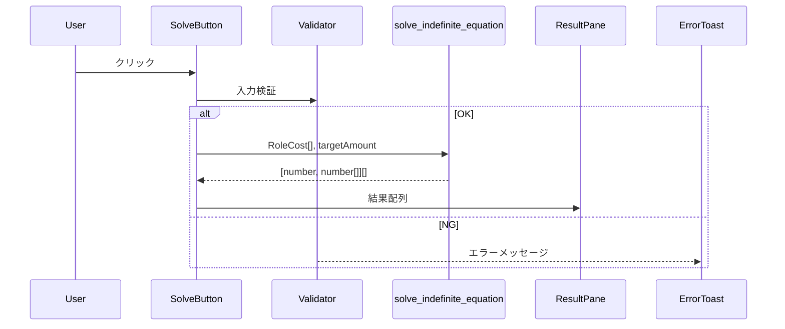

# 技術仕様: 人件費調整ツール

---

## 1. アーキテクチャ概要

| 項目       | 採用技術 / 方針 | 補足 |
| ---------- | --------------- | ---- |
| バンドラー |                 |      |

| **Vite**       | 高速ビルド・HMR                    |                                                    |
| -------------- | ---------------------------------- | -------------------------------------------------- |
| UI             | **shadcn/ui + Tailwind CSS**       | コンポーネントとカスタマイズ性の両立               |
| フレームワーク | **React (関数コンポーネント)**     | クライアントサイドのみ (CSR)                       |
| 言語           | **TypeScript**                     | 型安全。外部バリデーションライブラリは不使用       |
| 状態管理       | **React hooks (useState/useMemo)** | シンプルに維持。外部状態管理ライブラリは導入しない |
| テーブル描画   | shadcn Table                       | 必要に応じ TanStack Table 等を追加検討             |
| テスト         | **Vitest**                         | 単体ロジック & React Testing Library               |

---

## 2. 画面構成

```
+-------------------------------------------------------------+
| ① 役職入力テーブル  (RoleInputTable)                         |
|-------------------------------------------------------------|
| ② 目標金額入力 (TargetInput) | [計算を開始する]  (SolveButton) |
|-------------------------------------------------------------|
| ③ 結果表示欄 (ResultPane)                                   |
+-------------------------------------------------------------+
```

- **結果表示欄** は縦スクロール可能な領域。行数が多い場合、100件単位でページングを行う。
  何件中〇～△件表示というのを表の右肩部分に表示する。
  前後ページ送り機能のほか、指定したページへ飛ぶ機能もつける。

---

## 3. コンポーネント構造

| Component        | 役割                                                                         |
| ---------------- | ---------------------------------------------------------------------------- |
| `RoleInputTable` | 役職・人件費・人数の編集用テーブル。行追加/削除対応。                        |
| `TargetInput`    | 目標金額の入力フォーム。                                                     |
| `SolveButton`    | バリデーション → `solve_indefinite_equation` 呼び出しを行う。                |
| `ResultPane`     | 計算結果を shadcn Table で表示。解がない場合は `解が見つかりません` を表示。 |
| `ErrorToast`     | 入力エラーや計算エラーをトーストで通知。                                     |

---

## 4. 型定義

```ts
export type RoleCost = {
  role: string;
  cost: number; // 1人日単価
  count: number; // 人数
};

// solve_indefinite_equation の戻り値
// [変動係数, 不定方程式の解（配列）] の配列
export type SolveResult = [number, number[]][];
```

---

## 5. ステート設計 (抜粋)

| State          | 型               | 説明                       |
| -------------- | ---------------- | -------------------------- |
| `roles`        | `RoleCost[]`     | 入力テーブルの行データ     |
| `targetAmount` | `number`         | 目標金額                   |
| `results`      | `SolveResult`    | 計算結果                   |
| `error`        | `string \| null` | バリデーション／計算エラー |

---

## 6. バリデーション実装

- `handleSolve` 内で以下を順番にチェック
  1. 数値項目が自然数か
  2. 役職名重複 (`trim()` 済, 全角半角差を無視した一致を想定)
- エラー検出時は `error` に文言を設定し、`ErrorToast` で表示。

---

## 7. 計算フロー



---

## 8. 結果表示仕様

- **表示形式**: shadcn Table (ヘッダ=役職, 行=日数)。複数解はテーブルの縦方向に連結表示。
- **解が 0 件**: `<ResultPane>"解が見つかりません"` と中央揃えで表示。
- **パフォーマンス**: 行数が100行を超えた場合、ページングを行う。

---

## 9. テスト戦略

| テスト種別     | ツール                 | 観点                                                       |
| -------------- | ---------------------- | ---------------------------------------------------------- |
| 単体 (Logic)   | Vitest                 | solve_indefinite_equation 呼び出し I/F・バリデーション関数 |
| コンポーネント | @testing-library/react | 入力 → ボタン → 結果描画フロー                             |
| E2E (任意)     | -                      | 規模小のため当面不要。                                     |

---

## 10. 今後の検討

| 項目           | 内容                                 |
| -------------- | ------------------------------------ |
| 仮想スクロール | 解が多いケースのパフォーマンス向上策 |
| PWA 対応       | オフラインでも計算可能にするか       |
| デプロイ       | Vercel / Netlify / GitHub Pages      |
| CI/CD          | GitHub Actions で Vitest 実行        |

---

### 補足: 丸め処理

- 計算は自然数のみを対象とし、小数は発生しないため丸め処理は行わない。
